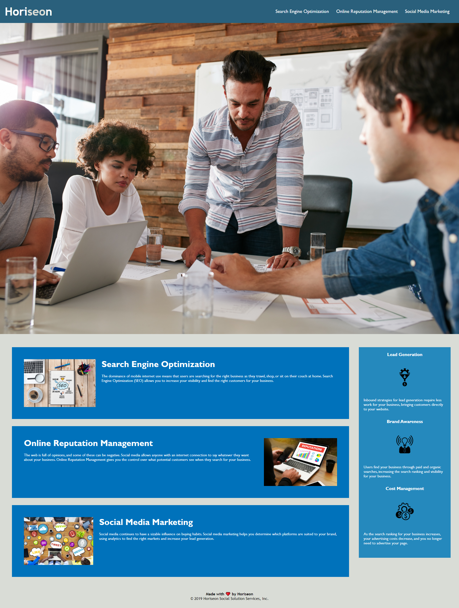

# Horiseon

## Table of Contents
* [Deployed](#deployed)
* [Technologies](#technologies)
* [Description](#description)
* [Preview](#preview)
* [Questions](#questions)
* [Credits](#credits)

## Deployed
Access the website at https://sarawrmas.github.io/Horiseon/

## Technologies
* HTML
* CSS

## Description
Horiseon is a resource for digital marketing. At the top of the page, the user will
find links to navigate to each of the three main sections, detailing the services 
provided by Horiseon. To the right, you will find a description of the benefits that Horiseon is sure to provide you and your business.

## Preview

## Questions
Have questions about this project?  
GitHub: https://github.com/sarawrmas  
Email: sara.m.adamski@gmail.com

## Credits
This website was developed by the instructors at UT Austin.  
My contributions include:
* Ensuring functionality of website and its links.
* Correcting repetitive code and reclassifying id's and classes in HTML and CSS files.
* Following provided mockup to create a website specified to the client's needs